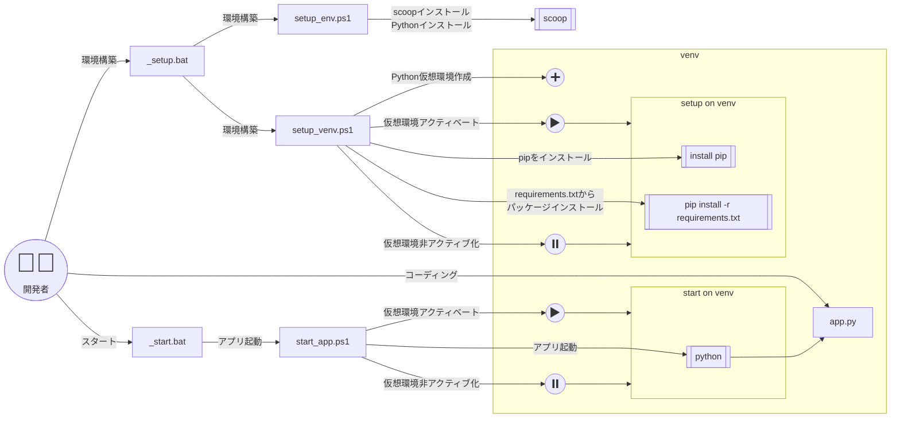
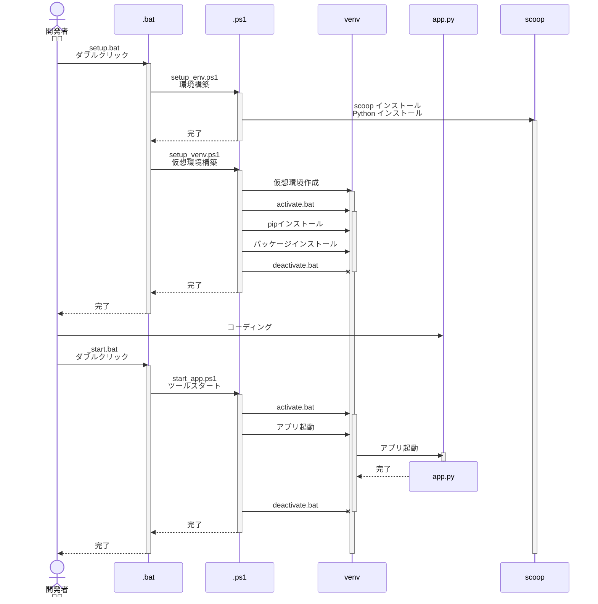

# Pythonプログラムを気軽に作り始められる環境

## 概要

このツールは、Pythonベースのツール実行環境を簡単にセットアップし、ツールを起動するためのスクリプトです。Scoopを使用して必要なツールやライブラリを自動的にインストールし、Pythonの仮想環境を構築します。これにより、環境構築の手間を大幅に削減できます。

---

## 使い方（とても簡単😁）

1. このフォルダを任意の場所に展開します。
2. `_setup.bat` をダブルクリックします。
  処理概要
    - [Scoop](https://scoop.sh/)のインストール（未インストールの場合）
    [Scoopとは](https://qiita.com/talesleaves/items/0880bf31359715035a3c) / [Windowsで環境を極力汚さずにPythonを動かす方法 (Scoop編)](https://qiita.com/rhene/items/a5616857981293d06940)
    - gitのインストール（Scoop使用）
    - gitのsslbackendの設定
    [GitでWindowsの認証局ストアに登録されたルート証明書を使用する](https://qiita.com/akayuki/items/1497ea6c53b63e8691bd)
    - versions bucketの追加
    - Pythonのインストール（Scoop使用）
    - 仮想環境の作成（venv）
    - 仮想環境のアクティベート
    - 仮想環境へpipのインストール
    - 必要なPythonパッケージのインストール（`requirements.txt`を使用）
 

3. `_start.bat` をダブルクリックします。
  処理概要
    - 仮想環境のアクティベート
    - 必要なPythonパッケージのインストール（`requirements.txt`を使用）
    - ツールの起動（`app.py`を実行）
    - 仮想環境のディアクティベート

うまく動作しないときは、`_clean.bat`を実行し、再度`_setup.bat`からやり直してください。

---

## 動作環境

- Windows 10 以降
- インターネット接続（初回セットアップ時に必要）

---

## 概要図

### スクリプト関連図

:::mermaid

:::

### スクリプト動作シーケンス図

:::mermaid

:::

---
